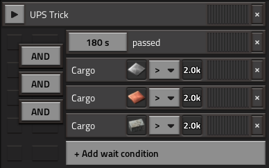

# Tutorial: UPS Optimization

## NOTE:

This article is intended to show users how to generally change their factory designs to make their bases more performant.
For figuring out what specific components of your base are consuming more time than they should, see [Diagnosing Performance Issues](https://wiki.factorio.com/Tutorial:Diagnosing_performance_issues).

## Definition

**Updates Per Second** (abbreviated UPS) is the measurement of frequency that Factorio's simulation runs at, which can be viewed by selecting the `show-fps` option in [debug mode](https://wiki.factorio.com/Debug_mode). By default, Factorio will try to run the game's simulation at a rate of 60 times per second. Having a UPS less than 60 means that the save is unable to simulate the game fast enough, which is a common problem when creating large, hardware-demanding factories.

**UPS Optimization** is the process of re/designing Factorio bases to try to be as hardware efficient as possible, usually to push the factory's scale to it's utmost limit on a particular machine. Even if not pushing for the largest production rate possible for a given computer, knowing the underlying computational cost between different game entities and interactions can help stave off or even prevent the onset of performance issues with large bases or on systems with weaker hardware.

## Limitations of this Article

This article is not intended to be a prescriptive tutorial on how you should build your factory. UPS efficiency is simply another factor to optimize your designs around, similar to speed, space efficiency, resource cost, power consumption, simplicity, robustness, beauty, and so forth. The content provided here is simply to illustrate how to build the most UPS efficient factory possible; whether or not you abide by these rules (or which rules you choose to abide by) are ultimately up to the player. Playing with biters on will always be less UPS efficient than playing with biters off, but that doesn't mean you can't play with biters if you want, and it also doesn't mean you can't improve your UPS via other means.

This article is not intended to provide advice for the average playthrough, because as long as your computer meets Factorio's minimum specs, the average Factorio playthrough has no need for performance optimizations. Factorio's mechanics are already highly optimized, and it is exceedingly rare for performance issues to arise before launching the first rocket. The content in this article is instead directed at users who wish to [megabase](https://wiki.factorio.com/Glossary#M), play large overhaul modpacks where the average base size is significantly larger than vanilla, or are running on hardware which lies below Factorio's recommended minimum.

This article is intended to be a general summary of all of the information and testing recorded and aggregated thus far related to keeping UPS as high as possible. **It is not (necessarily) a list of items that, if you fix, will make your game run better.** The UPS of a build or base is not a uniform measurement of a particular build's hardware efficiency, since there are many factors which influence UPS. If Build A has a higher UPS than Build B, then:

* Build A could truly be more hardware optimized than build B.
* Build A could be running on a machine with better hardware (CPU, RAM) than build B.
* Build A could be running on a different operating system than build B.
* Build A could be running on a different (perhaps more modern) version of Factorio than build B.
* Build B might have other applications running in the background while build A does not.
* Build A and build B might not be performing equivalent tasks, or the method of comparing them is malformed in some way.

When concerned with the task of optimizing ones base to be more performant, these external factors must be controlled against in order to gain a reasonable confidence in the difference of performance between two designs. Check time usage statistics in the debug menu to help determine what types of entities in your build are consuming disproportionally more time than others.

This article uses numerous user-created sources to assert its claims, all of which have been benchmarked to test their validity. While these tests are rigorous, they may also be out of date if they were performed on an older version of Factorio. Current or future Factorio versions may invalidate the advice given here, or may not; the only reliable way to be sure is to create a well designed benchmark and test it yourself. For a tutorial on how to properly create design benchmarks, see [here](https://www.reddit.com/r/technicalfactorio/comments/lxidhz/guide_how_to_benchmark_in_factorio/).

Finally, this article only claims to apply to vanilla Factorio. Many of the UPS optimization strategies listed here will apply to modded playthroughs just as well, but because of the sheer number of possible mod configurations and the variety of their behaviors, this article cannot reasonably hope to assert that the advice given here is applicable in even most cases. Again, your best bet if looking for UPS optimization advice specifically on modded playthroughs is to search their respective communities, ask the mod authors themselves, or, failing that, create benchmarks yourself and make the results publicly available.

## Performance List

Below is a list of the most important factors to UPS performance for a typical Factorio playthrough, ordered from most impactful to least impactful on final UPS. For best results, players should typically prefer remedying items higher on this list first before ones lower down. In each section, potential solutions are provided for each section, listed from most to least effective at improving UPS.

### 1. Usage of Modules and Beacons

The more that a Factorio save has to simulate, the slower the game save will be. Therefore, the most important step to making an efficient base is to *perform as few operations as possible to achieve your ultimate production goal.* If you can get equivalent production out of fewer machines with fewer logistical steps, then your UPS will almost certainly improve.

Towards this goal then, high-tier productivity modules become essential. With them, you need less input resources going into your factory to reach the same output production rate, reducing not only the resource cost itself but also the performance penalty caused by moving those items around your factory. And because productivity modules can be placed in multiple consecutive stages of a factory, their effect is multiplicative over the course of a production chain.

Because productivity modules on their own slow machines down, beaconing your machines with high-tier speed modules becomes the next highest priority. This entirely counteracts the slowdown of productivity, and allows you to now also use less machines overall for the same target production, reducing overall base size and thus the performance penalty for item logistics even more. However, try to use as few beacons as possible while still maintaining maximum production; beacons do consume UPS themselves, so excessive usage of them will be worse for UPS than efficient usage. The most optimal UPS designs have maximum beacon overlap, so that each beacon is influencing as many assembling machines as possible.

By extension, quality itself is another modifier towards this goal, as high quality machines and modules with give even higher ratios if input material to output material. A legendary assembler filled with legendary productivity modules, surrounded by legendary beacons with legendary speed modules, has the highest production rate (and thus UPS potential) possible.

#### Solutions

* Always use the highest tier and quality production machines (assembling machines, oil refineries, chemical plants, etc.).
* Always prefer the highest tier and quality productivity modules inside of machines wherever possible, defaulting to speed modules otherwise, and potentially efficiency modules in select circumstances (such as when trying to reduce pollution on biter heavy maps; see next section). 
* Use beacons with the highest tier and quality speed modules, and try to overlap each beacon with as many machines as possible, since beacons themselves have a (small) UPS cost of their own.

### 2. Biters and Pollution

Due to their expensive pathfinding, collision checking, and total count typically being measured in the thousands, Biters (and AI forces in general) are the typically the most expensive component of a vanilla factory when reaching megabase scale. It is very common for even normal size bases to slow down when performing large artillery barrages on many thousands of biter nests, but even idle biters not sending attack groups can result in the largest proportional UPS drain of a typical base.

Pollution, on it's own, does not lower UPS by much at all, even at megabase scale. What pollution does do is aggravate biters which come into contact with it, causing them to form large attack groups with expensive pathfinding. Furthermore, pollution will generate new chunks with which it comes into contact with, which typically also have more biter nests which will become aggravated.

For players who are on an existing vanilla save or want to play with biters on, the best option to remain as high a UPS as possible is to leave as few biters on the map as possible. This will decrease their effect on UPS proportionally, and it will decrease the chances of your pollution cloud touching enemy nests and triggering attacks. Keeping your pollution cloud under control using efficiency modules can also be important, particularly when the pollution cloud would be generating new uncharted chunks and thus generating new nests. However, if biter expansion is on, then having a small pollution cloud will only delay biters from attempting to expand into it, so it is not a permanent solution.

It is possible to remove all biters completely from a vanilla save without cheating, but it requires a lot of set up in order to perform and poses some restrictions on the players in the map. See [here](TODO) for more details.

For players intending to build the most UPS efficient bases possible, playing entirely without biters is the most optimal. If playing vanilla Factorio where pollution as a mechanic is only used in conjunction with biters, you can also safely turn off pollution in order to save a small margin more of UPS.

#### Solutions

* Play without biters (and pollution, if not necessary).
* Remove all biters on the map, or as many as can reasonably be expected.
* Keep your pollution cloud small to avoid populating new chunks, and to prevent biter aggravation and attack parties.

### 3. Inserters

Inserters are the most UPS costly component of Factorio's logistical puzzle, not strictly because of their individual cost, but because they are so ubiquitous in every base. Moving items in and out of assemblers, trains, chests, silos, and any other building is almost exclusively performed by inserters. In addition to their frequency of use, inserters have complex movement, activation behaviors, and conditions, making them more expensive to simulate than some other Factorio entities. As a result, the most UPS optimal bases reduce the number of necessary inserters as much as possible, or more specifically, *the amount of time inserters are moving* as much as possible. 

The simplest way to optimize inserters in your base is to simply remove ones that are unnecessary. Consider the following image, which is a breakdown of logistic steps in a "City Block" base (pictured top) and a Direct Insertion setup (pictured bottom):

Notice that even though the City Block design is much larger, the actual number of production machines (drills, furnaces, assemblers) are identical between the two designs; 90% of the additional space is just for train loading/unloading and the belt balancers. The bottom design does the exact same thing as the top, but with fewer inserters, with fewer belts, over a smaller area, and eliminates the performance cost of train transport entirely.

Aside from simply removing unnecessary item transfers, always prefer using inserters with the largest stack size and swing speed available, as this results in the most items transferred for the least amount of time moving. In the example above, the City Block design uses fast inserters instead of bulk inserters, meaning that the fast inserter will have to swing more times (and remain active for longer) to move the same amount of items compared to a bulk inserter. Using inserters with large stack sizes is almost always better than using inserters with smaller ones - the only exception to this is when the stack size of the item being transferred is less than the stack size of both inserters. A fast inserter will consume an equal amount UPS to a bulk inserter when transferring [satellites](https://wiki.factorio.com/Satellite), because both can only hold one satellite at a time and they swing at the same rate.

City-block designs are useful for their modularity and ease of expansion, but because of their overreliance on item transfers between logistics types and their excessive use inserters, they're far from UPS optimal. A city-block base that uses all other tricks and best-practiced defined on this article will *never* be more UPS optimized than a base that uses a simpler method of item logistics, due to how important the efficiency of item transport is for the final UPS of a base.

In parallel to decreasing the amount of time inserters are active, ensuring an inserter's swing *efficiency* is also of utmost importance. Left to their own devices, inserters have a tendency to swing more often than is needed, hurting UPS. A bulk inserter with a stack size of 12 might only grab 1 item from an assembling machine before deciding to swing, causing it to swing 12 times as much as actually necessary. This concept is typically referred to as inserter *"thrashing"*, after the rapid, undesirable movements that affected inserters make.

The most natural way to reduce inserter thrashing is to simply produce more materials than you consume for a given production line. If you do this, machines will slowly fill up with input material as their outputs become saturated, meaning that inserters will only transfer items when space opens up in the destination, and when they do it will typically be a full stack. Colloquially, this idea of overbuilding inputs to guarantee item saturation is referred to as *"Backpressure"*.

*The left output belt consumes more than the assembler can produce, while the right one generates surplus. The right inserter grabs multiple speed modules every swing, while the one on the left only picks up one per swing. For illustration purposes; not UPS optimal.*

Not only does creating backpressure ensure that inserter swings will contain maximum items, it also allows the entire production line to *"sleep"*, or enter a low UPS cost idle state. When machines and inserters are sleeping due to backpressure, they consume less UPS overall, meaning that a production line that has more, inactive machines might paradoxically perform better than a production line with the bare minimum amount of machines needed, entirely due simply to the reduction in inserter swings.

Backpressure is the preferred method for reducing inserter activity, as it adds no further complexity to the production line (and thus no performance overhead). Sometimes however, backpressure cannot be achieved by overproduction of previous steps, particularly when crafting times for certain items are especially long. The best example of this is in smelting recipes, which are both required in huge amounts alongside a slow crafting speed. It's very difficult to get backpressure here naturally (why?), and inserters by default will swing holding very few items.

However, we can coerce inserters to behave as we want using the [Circuit Network](https://wiki.factorio.com/Circuit_network). By creating a [pulse generator](https://wiki.factorio.com/Tutorial:Combinator_tutorial#Pulse_generators), we can wait a certain amount of time for a full stack's worth of items to be produced before sending a signal to the inserters telling them to swing:

*The left side is default, and the right side is clocked. The left side output inserters swing far more than the ones on the right. For illustration purposes; not UPS optimal.*

Using this technique gains the benefits of backpressure without actually having to overproduce machines, but comes at the cost of a slight overhead from the clock circuit itself. In fact, this overhead from the clock can actually exceed the benefit from the reduction in inserter swings, so if you decide to use this method benchmarking your design is necessary. Smelting recipes and electronic circuits tend to see the most noticeable improvement from inserter clocking; other recipes don't typically see quite the volume necessary for inserter clocking to be more optimal than default behavior. As always, test and see for yourself, since minute differences in designs can have large impacts on UPS performance. For a more detailed guide on how to build inserter clocks and properly determine their period, see [here](https://www.reddit.com/r/technicalfactorio/comments/ju2ngg/inserter_clocking_tutorial/).

If you do clock inserters, prefer a single clock operating many machines/inserters simultaneously, as this reduces the overhead required as much as possible. Take care to design your clock properly so that the wire connected to the inserters only pulses (changes) once when you want the inserters to swing. If the inserter wire instead changes every tick, the game then has to check *every* condition on *every* connected inserter *every* tick, consuming far more UPS that could otherwise be saved. (For more detailed information on circuit network performance, see the [Circuit Network section](TODO) below.)

#### Solutions

* Design/redesign your base around reducing the number of inserter swings. Direct Insertion between machines is king - it is the most simple way to take the output of one machine and put it into another. If you need to move a certain amount of items around with inserters, calculate the minimum count you would need to move those materials, and try to restrict yourself to using only that count.
* If you don't want to use Direct Insertion, avoid moving items between logistics types. If you want to use belts, use *only* belts; if you want to use trains, use *only* trains. Avoid moving items from trains onto belts, or from belts onto trains; doing this is essentially redundant. You can use bots as well, but read their section below for caveats.
* Always use the fastest inserter possible with the highest stack size possible, *if* it will reduce the total amount of time that the inserter will remain active.
* Always employ backpressure wherever possible. This allows for not just inserters, but *all* machinery to sleep as frequently as possible, improving UPS. In addition, this has the benefit of making inserters pick up their maximum stack size of items when swinging, forcing them to use as few swings as possible to transfer the amount of items needed.
* Inserter clocking can be used to force inserters to pick up their maximum stack size in circumstances where natural backpressure is infeasible. Benchmarks must be made to verify that the additional overhead of the timing circuit does not exceed the UPS gain from fewer inserter swings. Users should also be careful when building the clocks themselves, as having them improperly constructed can exacerbate their UPS overhead.

### 4. Fluid Networks

(TODO. This subject will likely change a lot with the new fluid mechanics. However, the rule of having as few fluid carrying entities as possible will likely still hold true.)

#### Solutions

* Use as few fluid network entities as possible.
* Producing fluid on-site (particularly water with offshore pumps) is almost always better than attempting to transport it over any distance.

### 5. Power Generation

The most UPS efficient method for generating power is with solar panels and accumulators, and by a wide margin. Factorio is able to optimize the solar panels and accumulators together into one massive entity, whereupon it calculates power generated in constant time as `brightness of sun * power output of solar panel * number of solar panels`. Accumulators are similarly optimized, since they trend towards having the same charge and discharge cycles naturally some time after being placed, meaning that as time progresses the complexity of accumulator calculations is also `O(1)`. This means that theoretically their power production can be scaled infinitely with no additional UPS cost, only being limited by your save size and system memory. The only drawback to using solar panels in a factory is the massive amount of resources, space, and time that they require to generate enough power for large bases, but this is a gameplay consideration, not a UPS one.

Reactors, by comparison, are much more involved. They have both heat and fluid networks which are both complex and expensive to simulate. For perspective, the time cost of just the reactors themselves is the sum of 4 different entity categories (`Boiler`,`Reactor`,`Heat Manager`, and `Generator`). In addition, reactors need a whole suite of supporting infrastructure to remain operational; uranium miners, sulfuric acid production, centrifuges, fuel assemblers, waste processing, and of course the logistics to transport all the items and fluids necessary to support this production chain. Solar panels have no such runtime requirements once they're constructed, and thus no additional UPS cost whatsoever.

Any power setup that boils steam for power will almost certainly be more complex to run and thus less UPS performant than solar panels. However, among said boiler setups, the ones with the highest energy density are always the best option for UPS, as they require the fewest number of entities to produce a particular power demand, reducing their simulation complexity and the infrastructure needed to support them. This means that fusion reactors are better than nuclear reactors, and that both of those are far better than steam engines.

(TODO: a comparison of heat networks. This will likely change in 2.0 with the advent of fusion reactors, though it's unlikely that they will ultimately trump solar panels at the extreme.)

(TODO: However, due to their large space requirements, solar panels are suboptimal for power generation on a [Space Platform](TODO). In this circumstance, you're better off going with fusion reactors.)

#### Solutions

* Use solar panels and accumulators for power generation, if possible.
* If you cannot/do not want to use solar panels, then power setups with the highest energy density should always be preferred.
* If you cannot/do not want to use solar panels, keep your boiler setups (of whatever kind) as simple as possible. Avoid using more heat pipes on nuclear reactors than necessary. Avoid storing water or steam in tanks, or sending them through elaborate pipe networks prior to discharging them through turbines.

### 6. Electric Networks

When a base has excess power production, the active speed of all entities are constant - they are simply capped to their maximum speed, which does not fluctuate with surplus power.However, when power supply dips even slightly below complete satisfaction, the speed at which machines operate now has to be dynamically calculated as some fraction of their original speed; and it has to be done for every single active entity in the network, for every tick power is insufficient. This additional cost usually comes in the form of a large lag spike that appears whenever power dips below minimum satisfaction. Avoid this to ensure smooth performance.

Expanding/merging/separating power networks are relatively expensive operations, though typically they only happen during construction instead of during a base's operation. The one exception to this is [Power Switches](https://wiki.factorio.com/Power_switch), which dynamically connect and disconnect electrical networks based on some logistic or circuit condition. Frequently doing this on very large networks will start to incur a noticeable performance cost. If using a power switch for an emergency power setup and your circuit "thrashes" when approaching it's configured threshold, then consider creating a [latch](https://wiki.factorio.com/Tutorial:Circuit_network_cookbook#Latches) to govern it instead.

Electric networks in Factorio are not multithreaded [[1]](https://mulark.github.io/tests/test-000013/test-000013.html), which means all entity energy drain and production calculations have to be done per entity per electric network they are a part of. In most Factorio bases, the entire base lies on one single connected electric network, so this is imperceptible. However, bases with very many (>100) isolated electric networks can start to incur a noticeable performance cost, and if such networks are superfluous, offer a quick avenue for optimization.

#### Solutions

* Ensure that the base always has a surplus of power production, such that brownouts and blackouts never occur (or occur as infrequently as possible).
* Avoid using power switches to dynamically combine and separate electric networks, where possible. If they must exist, reduce the frequency in which it is triggered.
* Combine many small electric energy networks into one large one, whenever possible. Remove any unnecessary isolated electric networks where they occur.
* If two separate electric networks must exist, reduce the number of entities that lie in both networks at the same time. Entities that do this have to share their power demand and consumption, meaning that they are processed `N` times for the `N` networks they overlap.

### 7. Bot Networks

Between the "primary" logistics options (belts, trains, and bots) bots are the worst option for bulk transport, which is almost all of the logistics of a large scale base. Bots excel in transporting small quantities of complex items and delivering items to players, but for large scale transport their tiny relative cargo size means the quantity of bots required is prohibitively high, even with many bot-speed technologies researched. The only vanilla recipe for which it has been shown that bots are at least as good as the other logistical options is when delivering satellites to rocket silos, due to the very low throughput required.

If bots are desired regardless, reduce bot network footprint as much as possible, in order to reduce the total distanced traveled between robots. This is desirable outside of UPS anyway, as it reduces energy consumption and requires less recharging, resulting in both fewer roboports and fewer robots in flight.

#### Solutions

* Avoid using logistics bots to transport bulk items entirely, preferring belts or trains.
* Avoid having large robot networks. Robot cost is directly proportional to the amount of time spent flying from point to point. Reducing the distance between destinations not only reduces the amount of time robots spend flying (and thus their energy use), but it also reduces the total amount of robots you need active to supply a given transfer rate, both of which improves UPS. [[1]](https://mulark.github.io/tests/test-000201/test-000201.html)
* Remove legacy roboports that are no longer used at all, *as empty, idle roboports do still consume UPS*. A good example of this is that players will typically build roboports into their solar arrays to allow them to be automatically constructed, but will neglect to remove the roboports once the array is fully constructed and robots are no longer need to travel there.

### 8. Trains

At megabase scale, trains themselves can also be a considerable UPS cost. Trains need to pathfind through the rail network, which is likely large and interconnected, providing many possible avenues to the destination which have to be compared. Further, trains perform collision checks at all times, and so they always have some overhead when they are moving from station to station. These collision checks are performed per wagon, meaning that the overall size of the train influences it's UPS cost, not just the amount of different trains pathfinding through the network. Trains with more wait conditions per stop also perform worse on average than trains with less wait conditions per stop.

Different categories of train stop conditions themselves also incur different UPS costs. [[1]](https://mulark.github.io/tests/test-000047/test-000047.html) Conditions such as "Time Passed" and "Inactivity" are much cheaper for the game to calculate when compared to conditions like "Item Count". If you have a very high amount train schedule stops which use a UPS expensive condition, switching to a cheaper equivalent condition across the board might yield a noticeable UPS improvement when the number of trains with said schedule is high.

Even if complex schedule conditions like "Item Count" are absolutely necessary, it may still be possible to reduce their UPS impact (under certain circumstances). For example, suppose you need to check a complex assortment of items at a particular station, but you know that it will take at least 3 minutes before the stop can reasonably be expected to  load those items. What you can do in this case is prepend a comparatively cheap "Time Passed" condition, ANDed with the rest of your wait conditions:

Factorio implements [short-circuiting](https://en.wikipedia.org/wiki/Short-circuit_evaluation) with wait conditions, which means that the game will check the "Time Passed" condition first, and will only evaluate the following expensive checks if it is true. Hence, instead of checking the set of expensive conditions every single tick while the train is stopped at that station, if the conditions are met by the time 3 minutes have passed, the game will only have to check the expensive conditions exactly once. [[2]](https://mulark.github.io/tests/test-000030/test-000030.html)

#### Solutions

* Reduce the number of moving rolling stock in your rail network. This can be achieved by either reducing the amount of trains in the network, reducing the size of each train in the network, or both.
* Fewer, larger trains cost less UPS on average than many, smaller trains. [[3]](https://mulark.github.io/tests/test-000104/test-000104.html)
* Increase the speed with which trains navigate your rail network. The less time trains are pathing on rails, the less impact they will have on your final UPS. [[4]](https://mulark.github.io/tests/test-000106/test-000106.html) This can be achieved by using the highest acceleration fuel available and by using train layouts with higher locomotive to wagon ratios.
* Simplify your rail networks. Avoid a single connected network with very many paths, in favor of smaller separate networks with only one or two paths. Not only will this reduce pathfinding time (if such a cost was large) but having more dedicated routes for each train will likely reduce the amount of time that trains have to wait at busy intersections. This decreases train travel time, and as a result reduces the total number of trains you need to maintain constant throughput; both of which being a compounding positive effect on UPS.
* Avoid long sections of diagonal rails where possible, preferring straight rails instead. Trains travelling on diagonal rails incur more collision checks than trains travelling on straight rails. There also seems some evidence to avoid placing rails over ore patches, but this effect is much more minimal. [[5]](https://mulark.github.io/tests/test-000051/test-000051.html)
* If your base contains train schedules with very many stops, prefer wait conditions like "Time Passed", "Inactivity", or "Circuit Condition", and avoid using conditions like "Item Count". If you need to have a complex set of wait conditions for a particular stop which is frequently used, consider prepending the condition with "Time Passed AND ..." to reduce the amount of time spent on those expensive wait conditions. 

### 9. Belts

[Since 0.16](https://www.factorio.com/blog/post/fff-176), belt mechanics changed to follow an optimized simulation scheme which is much more efficient than naively moving every item on every belt simultaneously. As a result, belts in modern Factorio are very well optimized already, and the margins for UPS improvement at this point become very narrow. Almost all of the optimizations regarding belts are actually optimizations involving how inserters interact with belts instead of the belts themselves. Still, there are some general best-practices one can follow to minimize belt UPS impact.

Firstly and most simply, avoid the use of splitters wherever possible. Splitters are rarely actually necessary, at least for the average megabase. Consider a simple belt balancer example, where 4 fully saturated blue belts of iron plates are sent to 4 steel smelting columns:

Here, the balancer in the middle is completely unnecessary. Each origin column produces 1 blue belt of iron plates, and each destination column consumes 1 full belt of iron plates; assuming that the inputs to the system remain similarly balanced (which they should), then the output will also remain perfectly balanced naturally, without the extra computation cost of the splitters. Consider another example with ore mining:

Players interested in making UPS optimal bases will want to research high levels of mining productivity, as this allows you to generate the required ore for your factory with as few mining drills as possible. Once a sufficient level is reached, a belt can be saturated with a single mining drill; once again making the balancer used next to the ore patch redundant. Since players interested in UPS optimization will likely research many levels of mining productivity anyway, this use of splitters entirely evaporates once sufficient progress into the game is reached.

Things like train car balancing with splitters are also simply not necessary - If you simply just wait until your train is completely full of cargo (which you'll want to do anyway to maximize your rail network throughput), this will guarantee that the train is in a known, "balanced" state. Having a train which is asymmetrically loaded can increase it's loading time, but this is a *throughput* issue, not necessarily a *balance* issue; and as such can be resolved without the use of splitters. The performance cost of splitters typically isn't very high (unless used excessively), but since they can be circumvented entirely they are the lowest hanging fruit of belt optimization techniques.

In addition to avoiding splitters, always prefer using the highest belt speed available. Faster belts allow you to transfer your desired amount of items with the fewest belts possible, or in other words allow you to transport the maximum number of items possible per a given number of belts. In addition, faster belts allow inserters to grab items more quickly than slower belts, reducing the average inserter swing time, improving UPS significantly.

Always keep input belts lanes compressed wherever possible. This is **NOT** because belts themselves are more UPS friendly when compressed; in isolation there is functionally no difference in performance between a compressed and uncompressed belt. [[1]](TODO) Rather, compressed belts reduce inserter swing time further, and come as a natural result of backpressure (alongside backpressures other benefits).

When having inserters pick up items from a belt, prefer only using one lane (one half) of the belt for that particular inserter. If the belt completely filled with items that the inserter wants, the inserter will pick up items from it's preferred lane, dependent on it's orientation. However, if it's preferred lane is not compressed, the inserter may choose to switch to the opposite lane to grab more items of the same kind. In general this increases inserter swing time, decreasing UPS.

If you do want to use full belts instead of half belts, compress your full belts down halfway down your production line, so that the preferred inserter lane is always as compressed as possible. [[1]](https://www.reddit.com/r/technicalfactorio/comments/nwu7ky/ups_efficient_double_sided_belts_same_item_on/)

(TODO: section on chest handoffs)

The final component for optimizing a factory's belts involves manipulating it's *Transport Lines*, which requires a least a basic knowledge of how belts are simulated internally. For a more complete and robust description on how modern (>1.0) belts operate, see this [article written by smurphy1](https://www.reddit.com/r/technicalfactorio/comments/r6ye86/mechanics_of_transport_line_splits/). Summarized simply:

- Items on belts follow what are termed "transport lines". Transport lines are typically multiple tiles long, but "break" (split) under certain circumstances to keep individual transport lines within a manageable set of lengths.
- You can view transport lines using the `show-transport-line` debug option. The lines have arrows indicating their direction, and are color coded based on their state.
- Transport line breaks are *always* created by splitters, underground belts, a change in belt speed (blue belt to red belt, for example), or a circuit/logistics condition which can stop the belt from moving. In addition, a transport line is always split if it is more than 200 tiles long.
- Transport line breaks can be *dynamically* caused by inserters picking up or putting down items onto a belt and during sideloading. After certain periods of inactivity, these dynamic line breaks can be joined back into one large one, known as "remerging".
- The UPS cost of dynamic splitting and remerging of transport lines caused by inserters and sideloads is comparatively expensive.
- Placing upstream inserters close to transport line breaks (less than 3 tiles away) prevents creating a new break, avoiding the expensive splitting and remerge logic mentioned above. Additionally, the closer the inserter is placed to the break, the less amount of time the game has to "search" that transport line to find the items it wants. By using underground belts, you can specify a transport line break in a particular spot to take advantage of these properties.
- Even better performance can be achieved by having multiple inserters share the same transport line segment, keeping them all close to an existing transport line break. This reduces the total number of transport lines along a belt that the game has to simulate, which offers slightly better results than forcing a new line break as close to each inserter as possible.

It should be mentioned however that the transport line optimization techniques mentioned here are very minute in effect, and very complex to do properly. Highly wasteful transport line management will have an almost imperceptible cost for the average megabase, let alone the regular playthrough. Such techniques are only typically employed when every single margin of performance is desired, and since the margins are so narrow between comparable designs, benchmarks at this stage are a must.

#### Solutions

* Avoid using splitters, if possible. If you need a certain amount of items on a belt, then put exactly those items on the belt in the first place. Most balancing operations can be substituted with overproduction and sideloading, which have additional positive UPS effect via backpressure. Train car balancing can also be similarly circumvented with careful and considerate factory design.
* Always use the fastest belt speed possible. The faster the belt, the quicker an inserter can pick up it's stack size worth of items and transfer it, reducing the amount of time that inserter is active. Faster belts also mean fewer belts to transport the same amount of items.
* When picking up items from a belt, keep belts compressed as much as possible to reduce active inserter time. Prefer having inserters pick up only from one side of the belt; picking up from both sides at the same time slows them down, keeps them active for longer, and thus reduces UPS. You can ensure this by either putting 2 different items on either lane, or by only using one lane of the entire belt.
* When designing your production blocks, try to have as few transport lines as possible. Try to put as many inserters as close to an existing transport line break as possible to prevent dynamic splitting and remerging of transport lines. Manipulate where exactly transport line breaks are placed using underground belts to have them as close to your inserters as possible to reduce item search time.

## Other Potential Causes of Lowered UPS

### Mods

Mods (particularly those with expensive per-tick updates) are a big potential reason why an otherwise UPS optimal base might be performing more poorly than expected.

(TODO: needs explanation why, and examples of mods that consume lots of UPS. Maybe Madzuri loaders? Would be a classic example.)

### Radars

Because radars constantly attempt to chart new chunks, having very many radars (>1000) can start to have a negative influence on UPS. Once an area within it's range is charted, consider replacing interior radars for ones further out on your base's perimeter, or simply reducing/removing them altogether.

If live base coverage is all you're looking for out of radars, consider the [VisionRadar mod](https://mods.factorio.com/mod/VisionRadar?from=search), which adds a radar which has no chunk scanning functionality (and thus very little UPS impact) but has a larger vision radius.

### Circuit Networks (In Massive Cases)

Circuit network cost per game tick can be roughly intuited as:
    
* `the number of signals changing on a network` *
* `the frequency of which those signals change on a network` *
* `the amount of connected entities influenced by these changes` *
* `the number of active circuit networks in the save`.

Having a disproportionately large amount of any of these categories (or all in conjunction) will likely see a performance cost. Note that the the first term in the cost is related to signals *changing*; this means that a wire with 200 constant signals will perform identically to a wire with 1 constant signal on it. Wire networks only incur a UPS cost when their contents update.

(TODO: section on the difference in cost between different combinator operation types)
